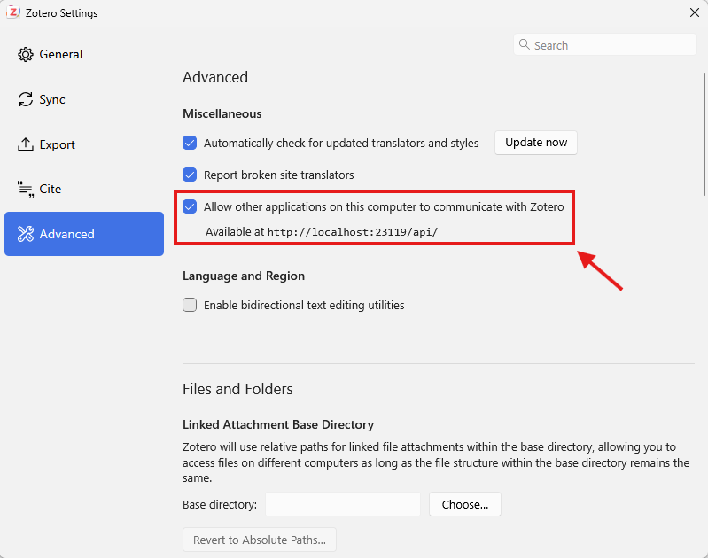

# Getting Started with Zotero MCP

This guide walks you through installing Zotero MCP and connecting it to your AI assistant. For every setting, see [Configuration](configuration.md); for problems, see [Troubleshooting](troubleshooting.md).

**Requirements**
- Python 3.10+
- Zotero 7+ (for local API with full-text access)
- An MCP-compatible client (e.g., Claude Desktop, ChatGPT Developer Mode, Cherry Studio, Chorus)

## Installation

```bash
uv tool install zotero-mcp-server   # recommended
pip install zotero-mcp-server       # or with pip
pipx install zotero-mcp-server      # or with pipx
```

Optional extras (`semantic`, `pdf`, `scite`, `all`) are listed in the [README](../README.md#optional-extras). If you are new to the command line, the community-built [Zotero MCP Setup](https://github.com/ehawkin/zotero-mcp-setup) has a macOS GUI installer (DMG), one-click install scripts for Mac and Windows, and a step-by-step guide.

## Configure Zotero

The server needs to know how to connect to your Zotero library. There are two main ways to do this.

### Option 1: Local Zotero (Recommended)

If you're running Zotero 7 or later on the same machine, you can connect to the local API:

1. Allow local connections in Zotero's settings:
   - Open Zotero
   - Open Settings (Edit → Settings on Windows/Linux, Zotero → Settings on macOS) → Advanced → Miscellaneous
   - Tick "Allow other applications on this computer to communicate with Zotero"

   

2. Set the environment variable:
   ```bash
   export ZOTERO_LOCAL=true
   ```

For **writes** you have two routes. On Zotero 10 or newer, run `zotero-mcp authorize-local` once and writes go straight to the running Zotero — see [Local write support](configuration.md#local-write-support). On any older Zotero the local API is read-only, so also set the web API variables below and the server writes through the Zotero web API instead ("hybrid mode": fast local reads, web API writes).

### Option 2: Zotero Web API

If you want to connect to your Zotero library via the web API:

1. Get your Zotero API key:
   - Go to [https://www.zotero.org/settings/keys](https://www.zotero.org/settings/keys)
   - Create a new key with appropriate permissions (at least "Read" access)

2. Find your library ID:
   - For personal libraries, your user ID is available at the same page
   - For group libraries, it's the number in the URL when viewing the group

3. Set the environment variables:
   ```bash
   export ZOTERO_API_KEY=your_api_key
   export ZOTERO_LIBRARY_ID=your_library_id
   export ZOTERO_LIBRARY_TYPE=user  # or 'group' for group libraries
   ```

## Integrating with Claude Desktop and Claude Code

1. **Auto-configure** (recommended):
   ```bash
   zotero-mcp setup
   ```

   `zotero-mcp setup` probes every known location of `claude_desktop_config.json`, writes to each one it finds, and prints the absolute path(s) it wrote so you can confirm it matched the build you actually run.

2. **Manual configuration**: for Claude Desktop, open its configuration file:
   - On macOS: `~/Library/Application Support/Claude/claude_desktop_config.json`
   - On Windows: `%APPDATA%\Claude\claude_desktop_config.json`

   Some Claude Desktop builds store the file elsewhere, for example
   `%LOCALAPPDATA%\Claude-3p\claude_desktop_config.json` on Windows or
   `~/Library/Application Support/Claude-3p/claude_desktop_config.json` on macOS.

   For Claude Code, add the server to `~/.claude.json`. The entry is the same for both:
   ```json
   {
     "mcpServers": {
       "zotero": {
         "command": "zotero-mcp",
         "env": {
           "ZOTERO_LOCAL": "true",
           "ZOTERO_API_KEY": "YOUR_API_KEY",
           "ZOTERO_LIBRARY_ID": "YOUR_LIBRARY_ID"
         }
       }
     }
   }
   ```

   For **local reads**, `ZOTERO_LOCAL: "true"` is all you need — drop the `ZOTERO_API_KEY` and `ZOTERO_LIBRARY_ID` lines entirely. Keep them only for web API writes on a Zotero older than 10 (for a group library, also set `ZOTERO_LIBRARY_TYPE: "group"`).

   > **Important Note**: Environment variables set in the shell you run `claude` in will override these values.

   > **Tip:** If Claude Desktop reports it can't find the `zotero-mcp` command, use the
   > absolute path instead (run `zotero-mcp setup-info` or `which zotero-mcp` to find it) —
   > GUI apps don't always inherit your shell `PATH`.

3. **Use it**:
   1. Start Zotero desktop (make sure the local API is enabled)
   2. Launch Claude Desktop / Claude Code
   3. In Claude Desktop, the Zotero tools appear in the tools interface (if not, check the connections menu under Settings). In Claude Code, run `/mcp` and make sure the Zotero server is connected.

If your agent has a shell (Claude Code, Cursor, Codex …), you can use `zotero-cli` through an agent skill instead of the MCP server, at a fraction of the context cost: `zotero-mcp install-skill`. See [CLI and agent skill](cli.md).

## Authenticated HTTP clients

For clients that connect over HTTP, set `ZOTERO_MCP_AUTH_TOKEN` on the server and
start it on loopback:

```bash
zotero-mcp serve --transport streamable-http --host 127.0.0.1 --port 8000
```

See [HTTP authentication and network access](configuration.md#http-authentication-and-network-access)
for token generation, persistent configuration, and non-loopback bind rules.
The examples below expect the same token in each client's environment. Starting
a client in another terminal does not automatically copy the server's environment.
For a remote deployment, replace the loopback URL with your authenticated HTTPS
endpoint.

### Claude Code

Merge this entry into your project's `.mcp.json`. Claude Code expands the token
from its environment when reading the HTTP headers:

```json
{
  "mcpServers": {
    "zotero": {
      "type": "http",
      "url": "http://127.0.0.1:8000/mcp",
      "headers": {
        "Authorization": "Bearer ${ZOTERO_MCP_AUTH_TOKEN}"
      }
    }
  }
}
```

Start Claude Code with that environment variable set, then check `/mcp`.
See [Claude Code's MCP configuration](https://code.claude.com/docs/en/mcp#environment-variable-expansion-in-mcp-json).
The earlier Claude Desktop example uses local `stdio` and needs no HTTP token.

### Codex

Add this entry to `~/.codex/config.toml`:

```toml
[mcp_servers.zotero]
url = "http://127.0.0.1:8000/mcp"
bearer_token_env_var = "ZOTERO_MCP_AUTH_TOKEN"
```

The value is the environment variable's name; Codex reads its contents and sends
the bearer header. Set it in the environment that launches Codex. See
[Codex MCP configuration](https://learn.chatgpt.com/docs/extend/mcp?surface=cli).

### Cursor

Merge this entry into `~/.cursor/mcp.json` or your project's `.cursor/mcp.json`:

```json
{
  "mcpServers": {
    "zotero": {
      "url": "http://127.0.0.1:8000/mcp",
      "headers": {
        "Authorization": "Bearer ${env:ZOTERO_MCP_AUTH_TOKEN}"
      }
    }
  }
}
```

Ensure Cursor inherits the variable, then restart it. Cursor uses the
`${env:NAME}` syntax for [configuration interpolation](https://cursor.com/docs/mcp#config-interpolation).

## Integrating with OpenAI's ChatGPT

### Recommended: OpenAI Secure MCP Tunnel

[OpenAI Secure MCP Tunnel](https://developers.openai.com/api/docs/guides/secure-mcp-tunnels)
connects a private MCP server to supported OpenAI products through outbound
HTTPS. It is the recommended ChatGPT path here because Zotero MCP can remain a
local `stdio` process without a public listener.

Availability depends on your account and workspace permissions. You need
ChatGPT developer-mode access, a Platform tunnel associated with the target
ChatGPT workspace, and a runtime API key. Managing the tunnel requires Tunnels
Read + Manage; running or selecting it requires Read + Use. Check the linked
OpenAI guide if the Tunnel option is unavailable.

1. Install [openai/tunnel-client](https://github.com/openai/tunnel-client) using its
   current installation instructions. On macOS, the repository recommends
   `brew install openai/tools/tunnel-client`. Run `tunnel-client help quickstart`.
2. Create or select a tunnel in [Platform tunnel settings](https://platform.openai.com/settings/organization/tunnels)
   and obtain the required runtime credentials. Supply the runtime key as
   `CONTROL_PLANE_API_KEY` in the terminal that will run the client. This is an
   OpenAI credential, separate from `ZOTERO_MCP_AUTH_TOKEN` and Zotero API keys.
3. Configure Zotero access as described above, keep Zotero running for local
   access, and create a profile. Replace the example tunnel ID with yours:

   ```bash
   export ZOTERO_LOCAL=true
   tunnel-client init \
     --sample sample_mcp_stdio_local \
     --profile zotero \
     --tunnel-id tunnel_0123456789abcdef0123456789abcdef \
     --mcp-command "zotero-mcp serve --transport stdio"
   tunnel-client doctor --profile zotero --explain
   tunnel-client run --profile zotero
   ```

   These are Bash commands; in PowerShell use `$env:ZOTERO_LOCAL = "true"` and
   enter the `init` command on one line. Use the full path to `zotero-mcp` if the
   tunnel client cannot find it. Keep one active tunnel client per tunnel ID
   for this stdio configuration; stop it before starting a replacement.
4. In ChatGPT's developer-mode app setup, choose **Tunnel** under **Connection**,
   then select the tunnel or enter its ID. Keep the client running during setup
   and use. Review the available tools before allowing access to your library.

The command/profile and single-instance guidance follow the
[tunnel-client repository](https://github.com/openai/tunnel-client). The app
connection and permissions follow the [OpenAI tunnel guide](https://developers.openai.com/api/docs/guides/secure-mcp-tunnels).
This recipe has not been tested end to end with Zotero MCP and a live ChatGPT
account. Confirm tool discovery and a read-only library query in your account.
Whatever the connected tools return is shared with the AI service; configured
write access can also let those tools modify your library.

### Direct ChatGPT connections and authentication

Zotero MCP's shared bearer token is not an OAuth server. OpenAI's
[authentication documentation](https://developers.openai.com/plugins/build/auth#client-identification)
states that ChatGPT cannot present custom API keys. Do not assume that a ChatGPT
connection form can send `ZOTERO_MCP_AUTH_TOKEN`, and do not select **No
authentication** for a public Zotero endpoint as a workaround. A direct public
ChatGPT connection needs a compatible authentication layer, such as an MCP OAuth
gateway, which is outside this guide.

## Public tunnel fallback (ngrok)

Use this fallback only with a client that can send the bearer header, such as
the [HTTP clients above](#authenticated-http-clients). It is not a direct
ChatGPT connection recipe.

1. Set `ZOTERO_MCP_AUTH_TOKEN` and start the authenticated HTTP server as above.
   Keep `--host 127.0.0.1`; a tunnel does not require a LAN listener.
2. Follow [ngrok's installation and account setup](https://ngrok.com/download).
   In a second terminal, run:

   ```bash
   ngrok http 8000
   ```

3. Use the HTTPS forwarding URL with `/mcp` appended as the client's server URL.
   Send the same `Authorization: Bearer <token>` header. The ngrok account's
   authtoken configures ngrok itself; it does not authenticate MCP callers.
4. Before using the public endpoint, verify that requests with a missing or
   incorrect token return HTTP 401, and that your authenticated client can
   discover tools and complete a read-only query. Keep both processes running
   only while needed.

The public URL and any `session_id` provide no authentication. Do not disable
Zotero MCP's token check to get past a client authentication failure. Use
`streamable-http` at `/mcp`; switching to deprecated SSE does not remove the
need for the bearer header.

## Integrating with Cherry Studio

Go to Settings -> MCP Servers -> Edit MCP Configuration, and add the following:

```json
{
  "mcpServers": {
    "zotero": {
      "name": "zotero",
      "type": "stdio",
      "isActive": true,
      "command": "zotero-mcp",
      "args": [],
      "env": {
        "ZOTERO_LOCAL": "true"
      }
    }
  }
}
```

Then click "Save". Cherry Studio also provides a visual configuration method for general settings and tools selection.

## Integrating with Chorus.sh

[Chorus.sh](https://chorus.sh) is a popular multi-chatbot interface that configures MCP servers through an online preferences form rather than config files.
This would be one possible path to working with Zotero with chatbots other than Claude.

To set up Zotero MCP with Chorus.sh:

1. **Find your installation path**:
   - For `uv tool install`: `~/.local/bin/zotero-mcp` on macOS and Linux
   - For other methods: use `zotero-mcp setup-info` to get the exact path and configuration details

2. **Configure in Chorus.sh preferences**:
   - **Command**: Enter the full path to your zotero-mcp installation
   - **Arguments**: Leave empty (no custom --port or --host arguments needed unless set at config time)
   - **Environment (JSON)**: Take your environment configuration JSON (including outer brackets), remove newlines, and paste as a single line

3. **Example Environment JSON** (single line format):
   ```json
   {"ZOTERO_LOCAL": "true"}
   ```

Many other MCP consumers use similar configuration approaches with command path, arguments, and environment variables.

## Integrating with Autohand Code

After installing Zotero MCP, add a local read-only server with:

```bash
autohand mcp add zotero env ZOTERO_LOCAL=true zotero-mcp
```

Add `--scope project` after `add` to keep the server configuration in the current project. For hybrid or web API access, add the credentials described above to the `env` command. See [Autohand Code](https://github.com/autohandai/code-cli/) for current installation and CLI details.

## Using with Other MCP Clients

Zotero MCP works with any MCP-compatible client. You can start the server manually:

```bash
zotero-mcp serve --transport stdio
```

For HTTP-based clients, configure [authentication](#authenticated-http-clients)
before starting the server:

```bash
zotero-mcp serve --transport streamable-http --host localhost --port 8000
```

The `sse` transport is still accepted but deprecated.

## Available Tools

The full, current tool list is in [Tools](tools.md). Search, metadata, full text, collections, tags, notes, annotations, PDF reading, adding and editing items, and semantic search are all covered; some groups are opt-in via `ZOTERO_MCP_TOOLSETS`.

## Example Queries

Once connected, you can ask things like:

- "Search my library for papers on machine learning"
- "Find recent articles I've added about climate change"
- "Summarize the key findings from my paper on quantum computing"
- "Extract all PDF annotations from my paper on neural networks"
- "Search my notes and annotations for mentions of 'reinforcement learning'"
- "Show me papers tagged '#Arm' excluding those with '#Crypt' in my library"
- "Export the BibTeX citation for papers on machine learning"
- "Highlight the main claims in this paper and box its key figures"
- **"Find papers conceptually similar to deep learning in computer vision"** *(semantic search)*
- **"Papers that discuss topics similar to this abstract: [paste text]"** *(semantic search)*

Something not working? See [Troubleshooting](troubleshooting.md).
