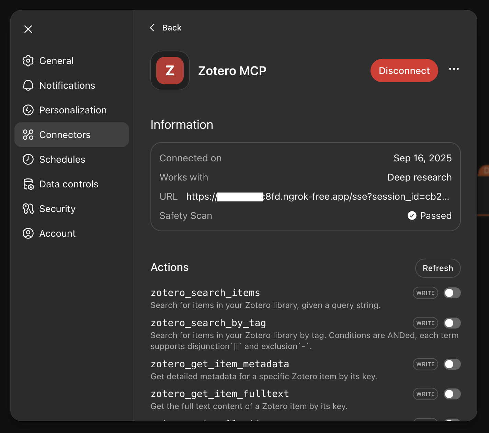
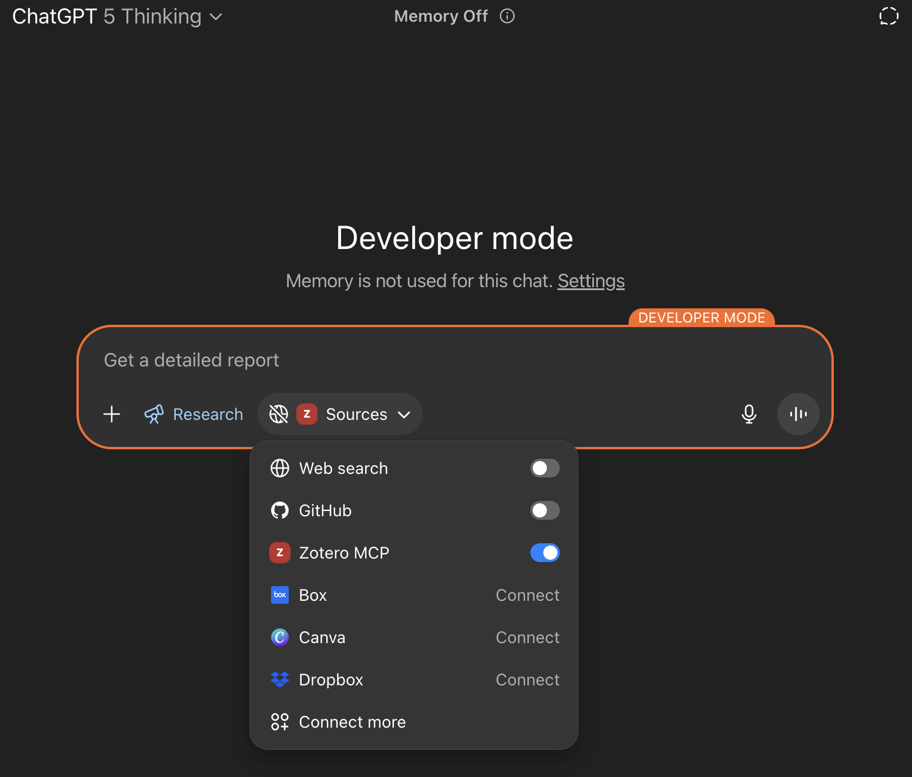

# Getting Started with Zotero MCP

This guide will walk you through the setup and basic usage of the Zotero MCP server, which allows AI assistants like Claude to interact with your Zotero library.

## Installation

First, install the Zotero MCP server using pip:

```bash
pip install zotero-mcp
```

## Configuration

The server needs to know how to connect to your Zotero library. There are two main ways to do this:

### Option 1: Local Zotero (Recommended)

If you're running Zotero 7 or newer on the same machine, you can connect to the local API:

1. Enable the local API in Zotero's preferences:
   - Open Zotero
   - Go to Edit > Preferences > Advanced > API
   - Check "Enable local API"

2. Set the environment variable:
   ```bash
   export ZOTERO_LOCAL=true
   ```

### Option 2: Zotero Web API

If you want to connect to your Zotero library via the web API:

1. Get your Zotero API key:
   - Go to [https://www.zotero.org/settings/keys](https://www.zotero.org/settings/keys)
   - Create a new key with appropriate permissions (at least "Read" access)
   
2. Find your library ID:
   - For personal libraries, your user ID is available at the same page
   - For group libraries, it's the number in the URL when viewing the group
   
3. Set the environment variables:
   ```bash
   export ZOTERO_API_KEY=your_api_key
   export ZOTERO_LIBRARY_ID=your_library_id
   export ZOTERO_LIBRARY_TYPE=user  # or 'group' for group libraries
   ```

## Integrating with Claude Desktop

To use Zotero MCP with Claude Desktop:

1. Make sure you have Claude Desktop installed
2. Open your Claude Desktop configuration:
   - On macOS: `~/Library/Application Support/Claude/claude_desktop_config.json`
   - On Windows: `%APPDATA%\Claude\claude_desktop_config.json`

3. Add the Zotero MCP server to the configuration:
   ```json
   {
     "mcpServers": {
       "zotero": {
         "command": "zotero-mcp",
         "env": {
           "ZOTERO_LOCAL": "true"
         }
       }
     }
   }
   ```

4. Restart Claude Desktop

- The tool should be available automatically: if not, you might need to double check in the connections menu under Settings.

## **New**: Integrating with OpenAI's ChatGPT

This is a new (September 2025) option available through the ChatGPT web app. For the web app, you must use [ChatGPT Developer mode](https://platform.openai.com/docs/guides/developer-mode) which may be restricted to a limited number of OpenAI platforms and apps. A paid subscription appears to be required.

As of today, zotero-mcp is not available by default on as a web-based MCP, and it seems likely that many users will want to stick with a local MCP due to their large document libraries. Since ChatGPT does not support local MCPs natively through their desktop app (yet?) the way you can move forward is by tunneling.

**Use at your own risk**
While we think that the risk to many individuals will be quite low (Zotero libraries are often composed of large numbers of publically-available documents), the risk of data loss or theft will be present. We are working on a way to secure the server connection (this should be available soon), but even with absolute security there is still the exposure to the AI itself, which we leave to the user to judge for themselves. Please consider your situation before continuing with this guide.

### Setting up a desktop tunnel for zotero-mcp

A tunnel makes your locally running `zotero-mcp` server securely available to a web service like ChatGPT. We recommend [ngrok](https://ngrok.com/) for this.

1.  **Install ngrok**: Follow the instructions on the [ngrok website](https://ngrok.com/download) to download and install it. Mac users can use `brew` and we have successfully tested this approach.

2.  **Start the `zotero-mcp` server**: Before starting the tunnel, make sure your MCP server is running. For web-based clients, the `sse` transport is recommended. Open a terminal and run:
    ```bash
    # Make sure your Zotero environment variables are set first!
    # e.g., export ZOTERO_LOCAL=true
    zotero-mcp serve --transport sse --host 0.0.0.0 --port 8000
    ```

Important: you should probably leave this terminal open in order to ensure tunnel traffic is successfully transiting to the server.

3.  **Start the ngrok tunnel**: Open a *second* terminal and start ngrok, pointing it to the port your server is using (8000). Here is an instruction that will work on a mac 
    ```bash
    ngrok http 8000
    ```
4.  **Copy the URL**: Ngrok will provide a public `Forwarding` URL that looks something like `https://<random-string>.ngrok-free.app`. Copy this HTTPS URL—you'll need it for the ChatGPT connector setup.

### Setting up a ChatGPT or OpenAI client for zotero-mcp
There are actually two ways to work with ChatGPT on the web once you have a tunnel open to your server: through the ChatGPT app at [chatgpt.com](https://chatgpt.com), or through the chat prompt builder screen at the [OpenAI platform page](https://platform.openai.com/chat).

The setup is nearly identical for both.

#### 1. ChatGPT.com setup 

1.  Navigate to [chatgpt.com](https://chatgpt.com). Make sure you are logged in, and at the base "chat" user interface.
2.  Click on your profile name, then **Settings**.
3.  Go to the **Connectors** tab:
    *   First you must enable "Developer Mode." At the bottom of the connectors tab, there is an "Advanced..." button. Click this and then on the next screen enable "Developer Mode."
    *   Now from the main Connectors browser window, click **Create**
4.  Fill in the details:
    *   **Name**: Zotero MCP
    *   **Description**: Search and retrieve documents from a local Zotero library.
    *   **MCP Server URL**: This is the critical part. You need to combine your ngrok URL, the `/sse/` endpoint (with a trailing slash), and a unique `session_id`.
        *   The trailing slash on `/sse/` is important to avoid a redirect.
        *   The `session_id` must be a valid [UUIDv4](https://www.uuidgenerator.net/). While some clients might negotiate a session automatically, explicitly providing a unique ID is the most reliable method.
        *   Example URL: `https://<YOUR_NGROK_URL>.ngrok-free.app/sse/?session_id=<YOUR_UUID>`
    *   **Authentication**: `No authentication`
    *   Tick the "I trust this application" checkbox.
5.  Click **Create**. If you are successfully connecting you should see relevant communications logs in your tunnel and your server terminals. If this is successful, an important indication will be the listing of all zotero-mcp tools in the ChatGPT interface.
    *   *Important: our testing indicates that you need to turn all the "Edit" sliders to "Off" in the list of tools.* Otherwise the tool may not be enabled in Developer Mode.

      

6.  You should now be ready to add Zotero-MCP to new chats. To do this, go to the main ChatGPT interface. It should indicate that you are in development mode. When you start a new chat, click the "plus" icon in the text box interface to select "Deep Research" as a chat mode. A "Sources" menu will become available: enable Zotero-MCP as one of the sources:

      

#### 2. OpenAI Chat Builder setup

The process is the same as above, but you create the connector within the context of building a custom GPT on the OpenAI Platform.

1.  Navigate to the [OpenAI Platform Chat page](https://platform.openai.com/chat).
2.  When configuring a custom GPT, go to the **Tools** section and choose to add an MCP connector.
3.  Follow the same steps as in the `ChatGPT.com setup` to configure the connector URL and other details.

## Integrating with Chorus.sh

[Chorus.sh](https://chorus.sh) is a popular multi-chatbot interface that configures MCP servers through an online preferences form rather than config files.
This would be one possible path to working with Zotero with chatbots other than Claude.

To set up Zotero MCP with Chorus.sh:

1. **Find your installation path**: 
   - For uv: typically `/Users/USERNAME/.pyenv/versions/3.12.8/bin/zotero-mcp` on macOS
   - For other methods: use `zotero-mcp --setup-info` to get the exact path and configuration details

2. **Configure in Chorus.sh preferences**:
   - **Command**: Enter the full path to your zotero-mcp installation
   - **Arguments**: Leave empty (no custom --port or --host arguments needed unless set at config time)
   - **Environment (JSON)**: Take your environment configuration JSON (including outer brackets), remove newlines, and paste as a single line

3. **Example Environment JSON** (single line format):
   ```json
   {"ZOTERO_LOCAL": "true"}
   ```

Many other MCP consumers use similar configuration approaches with command path, arguments, and environment variables.

## Using with Other MCP Clients

Zotero MCP works with any MCP-compatible client. You can start the server manually:

```bash
zotero-mcp --transport stdio
```

For HTTP/SSE-based clients:

```bash
zotero-mcp --transport sse --host localhost --port 8000
```


## Available Tools

When connected to Claude Desktop or another MCP client, you'll have access to these tools:

- **zotero_search_items**: Search your library by title, creator, or content
- **zotero_get_item_metadata**: Get detailed information about a specific item
- **zotero_get_item_fulltext**: Get the full text content of an item
- **zotero_get_collections**: List all collections in your library
- **zotero_get_collection_items**: Get all items in a specific collection
- **zotero_get_item_children**: Get child items (attachments, notes) for a specific item
- **zotero_get_tags**: Get all tags used in your library
- **zotero_get_recent**: Get recently added items to your library

## Example Queries

Once connected, you can ask Claude questions like:

- "Search my Zotero library for papers about machine learning"
- "Find articles by Smith in my Zotero library"
- "Show me my most recent additions to Zotero"
- "What collections do I have in my Zotero library?"
- "Get the full text of paper XYZ from my Zotero library"

## Troubleshooting

If you encounter issues:

- Make sure Zotero is running (for local API)
- Check that your API key has the correct permissions
- Verify your library ID and type
- Look for error messages in the Claude Desktop logs or MCP server output

### Local Library Limitations

Some functionality will not work for local libraries due to the distinct differences with [Zotero's local JS API](https://www.zotero.org/support/dev/client_coding/javascript_api). For instance, tagging and other library modifications might not work as expected with the local API connection.

**Workaround**: Even without web storage, a workaround for some of these functionalities might be to set up a web library, point the MCP at that, and then things like setting tags should work properly. We're thinking about better ways to work with local instances in future updates.

### Database Issues

Switching installs or install methods (sometimes to deal with failed installs), as well as toggling between search options, can sometimes lead to database problems. These can frequently be solved with:

```bash
zotero-mcp update-db --force-rebuild
```

Other than time waiting for the rebuild, there is generally little to no risk involved in triggering the rebuild - so if you're experiencing database-related issues, it's worth trying this command.

For more help, try the discussions](https://github.com/54yyyu/zotero-mcp/discussions).
